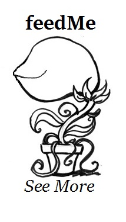

 

Company name: feedMe
Company slogan: See More
Company interest: Music/mixed media content
Company logo: <http://imgur.com/ssxCJqX>

Name: Zack Hardy (<zhardy@umass.edu> or <zhardy177@gmail.com>)

Previous CS Courses: 120 (Problem Solving Using the Internet), 121 (Introduction to Problem Solving with Computers), 191P (Introduction to Python), 187 (Programming with Data Structures), 220 (Programming Methodology), and a class at Smith college in Assembly using NASM. Also, I took CMPSCI 305: Social Issues in Computing.

Two previous college level courses: Digital Culture taught me a lot about what's going on in terms of the intersection of art and the Internet. History of Literary Critique forced me to think critically about all of the media that surrounds me on a day-to-day basis and think about the way it influences me.

Brief bio: I grew up in Massachusetts. I am a BDIC Major; my major is titled Writing in the Computer Sciences. I'm a senior. I've never written a full and working piece of software before, although I have designed a lot of websites and have had some experience with Android development. I work for both the BDIC program and the Writing Center on campus and host a weekly news show called "Tech Talk". 

Name: Luke Leheny (<lleheny@umass.edu>)

Previous CS courses: 121 (Introduction to Problem Solving with Computers), 187 (Programming with Data Structures), 220 (Programming Methodology), 230 (Systems Principles), 240 (Reasoning under Uncertainty), 250 (Computation), 311 (Algorithms), 377 (Operating Systems), 383 (Artificial Intelligence), and 305 (Social Issues in Computing)

Two courses taken outside of CS: Introduction to Logic, which has impacted the way I think, and Music Theory, which has helped me to be more creative.

Brief bio: I am from Providence, RI, currently a 5th year undergrad. I spend a lot of my time playing improvisational music. despite all those classes, I don't have that much experience coding. I know Java and C very well and Python fairly well. I have no experience in web programming whatsoever, but I am ready to learn some stuff.

Name: Josh McDuffie (<jmcduffi@umass.edu>)

Previous CS courses: CS 121 (Introduction to Problem Solving with Computers), 187 (Programming with Data Structures), 220 (Programming Methodology), 230 (Systems Principles), 240 (Reasoning under Uncertainty), 250 (Computation), 305 (Social Issues in Computing) and Mount Holyoke's Algorithms class.

Two Courses outside of CS: Introduction to Political Economics, really exposed me to different economic theories and impacted how I view the interactions between organizations. World Politics, this class helped me understand how the history of colonialism and the structure of global economics has shaped countries that we refer to as third world.

Brief bio: I'm from Worcester, MA currently 5th year undergrad and I'm pursuing a background in the Artificial Intelligence. The language I am most comfortable with is Java but I am putting a lot of effort in to learn Python. Outside of CS I am working on becoming certified in scuba diving and hope to make that a common activity of mine.

Name: Ben Tibbetts (<btibbett@umass.edu>)

Previous CS courses: 121, (Introduction to Problem Solving with Computers), 187 (Programming with Data Structures), 220 (Programming Methodology), and 250 (Computation)

Two Courses outside CS: Two Computational Linguistics classes that primarily use Python.

Brief bio: I’m from Damariscotta, Maine. I’m a 4th year undergrad, double majoring in linguistics and computer science. Most of my experience comes from the computer science classes that I’ve taken, but I like to solve Project Euler problems in my spare time. Primarily, I use Python and Java. I have some experience in Javascript, but fairly new to web programming.

Name: Tengiz Vachnadze (<tvachnad@umass.edu>)

Previous CS courses: 121 (Introduction to Problem Solving with Computers), 187 (Programming with Data Structures), 220 (Programming Methodology), 240 (Reasoning under Uncertainty), 250 (Computation).

Brief bio:  I'm a B.S in Computer Science. Most of my experience comes from what I've learned in these classes which is java and a little bit of c. I know the basics of html and not much beyond that. 

Name: David Carlson (<dscarlso@umass.edu>)

CS Courses:  187 (Programming with Data Structures), 197 (Unix) , 220 (Programming Methodology), 230 (Systems Principles), 240 (Reasoning under Uncertainty), 250 (Computation), 311 (Algorithms), 501 (Complexity Theory)

Courses outside CS: Digital Culture, Genetic Programming, Animals Robots & Design, 

Brief bio: Junior from Framingham, MA, pursuing something between A.I, Software Engineering and Robotics/Imagery (with a focus on graphical programming). I started programming in High School with C++, and learned C# on my own throughout Senior year where I made small graphical programs in Xna. The Genetics and Animal Robotics classes at Hampshire were a lot of fun. The former used Clojure and the latter was an Arduino based class (so C). Also I'm currently taking a Hampshire class called Interdisciplinary Game Project where we form a team as a class and we're making a puzzle game for iOS/Android. 
